# Ontology Dapi Demo Review

<!-- TOC -->

- [Ontology Dapi Demo Review](#ontology-dapi-demo-review)
    - [Install](#install)
    - [Interface](#interface)
    - [Ontology Web Wallet](#ontology-web-wallet)
        - [Balance Interface](#balance-interface)
        - [Provider](#provider)
            - [onIsInstalled](#onisinstalled)
            - [onGetName](#ongetname)
            - [onGetVersion](#ongetversion)
        - [Network](#network)
            - [getBlockHeight](#getblockheight)
            - [getBlock](#getblock)
            - [getBalance](#getbalance)
        - [Asset](#asset)
            - [getOwnAccounts](#getownaccounts)
            - [getDefaultAccount](#getdefaultaccount)
            - [makeTransfer](#maketransfer)
        - [Smart Contract](#smart-contract)
            - [Smart Contract Call](#smart-contract-call)
            - [Smart Contract Deploy](#smart-contract-deploy)

<!-- /TOC -->


## Install

```bash
git clone https://github.com/OntologyCommunityDevelopers/ontology-dapi-demo.git
```

```bash
npm install -g opencollective
npm install
npm start
```

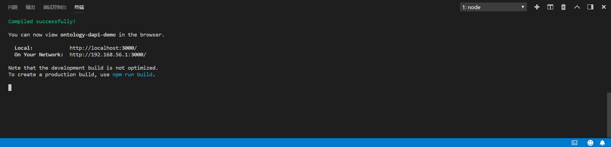


## Interface

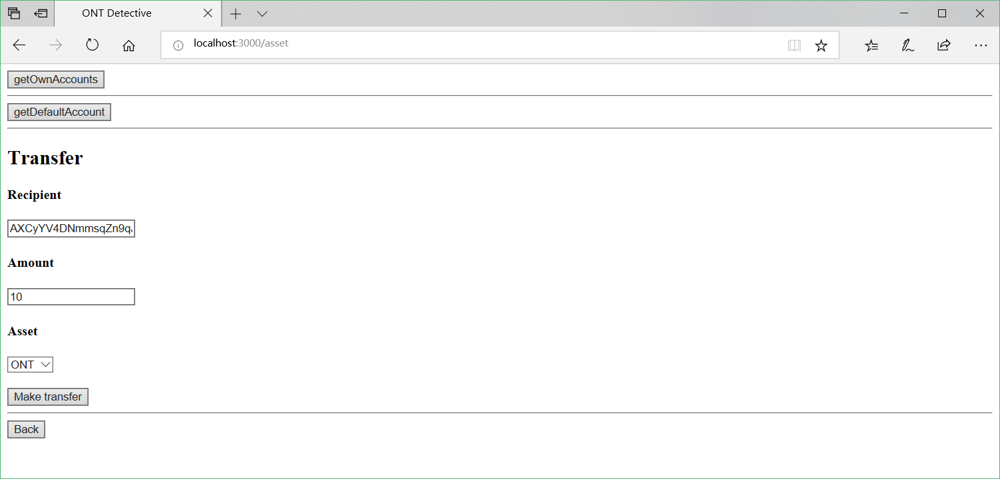

## Ontology Web Wallet

> https://github.com/OntologyCommunityDevelopers/ontology-plugin-wallet


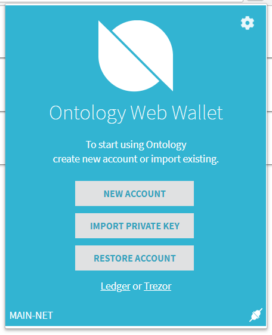


### Balance Interface

`Python SDK`获取到的`ONG`账户余额与插件中显示的账户余额小数点不一致。

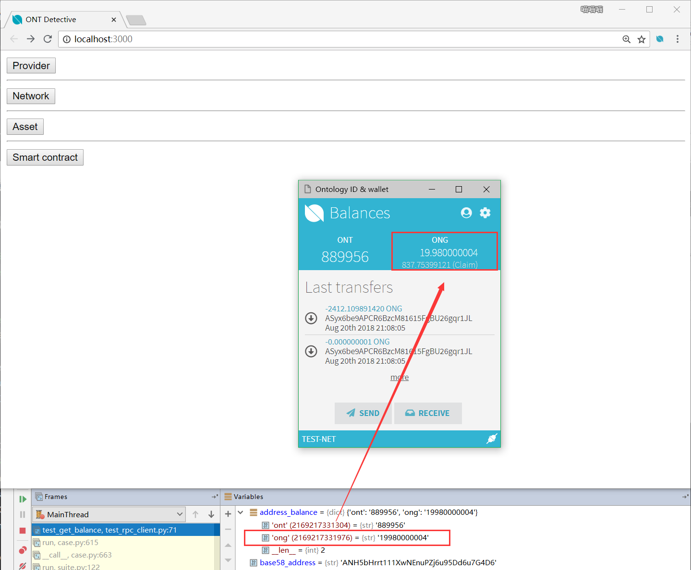

### Provider

#### onIsInstalled


#### onGetName

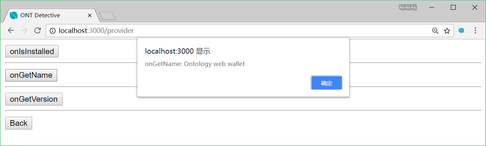

#### onGetVersion

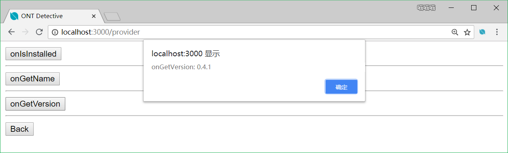

### Network

#### getBlockHeight

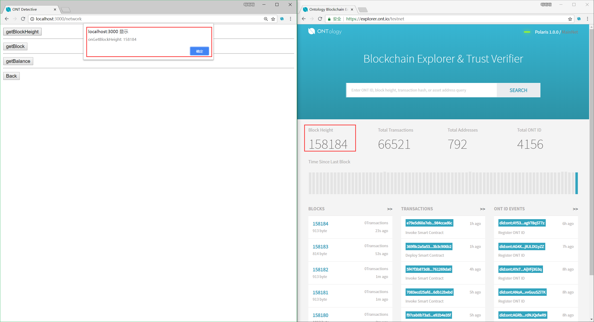

#### getBlock

在OEP6中定义的接口如下：

```js
function getBlock(block: number | string): Promise<Block>
```

实际使用时没有传入参数的地方，返回结果在区块链浏览器中也未查到。


#### getBalance

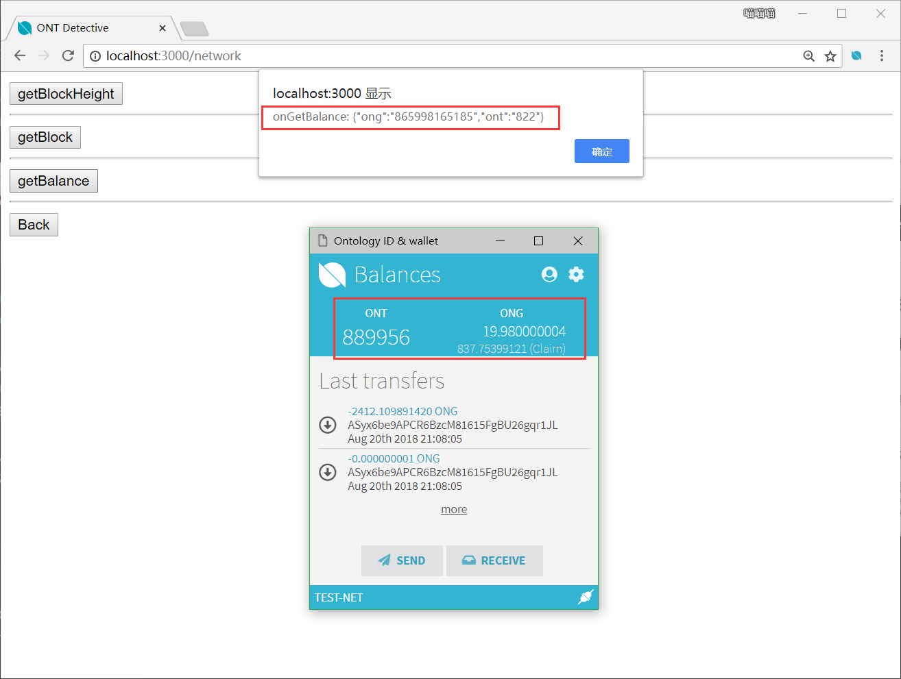

返回值与插件中显示的数据不一致。

### Asset

#### getOwnAccounts

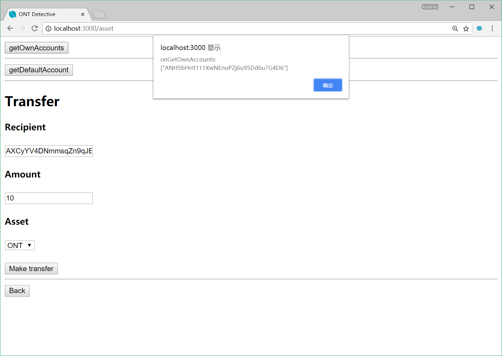

#### getDefaultAccount


#### makeTransfer


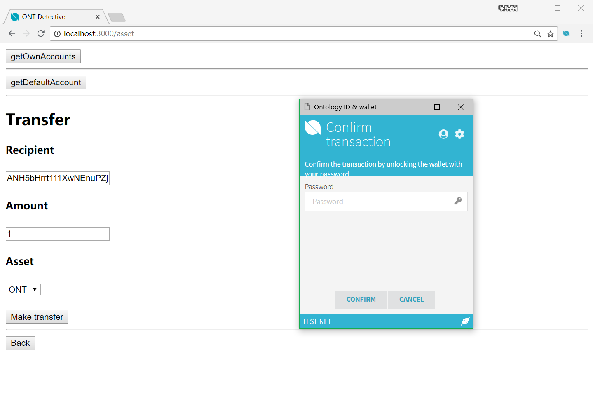

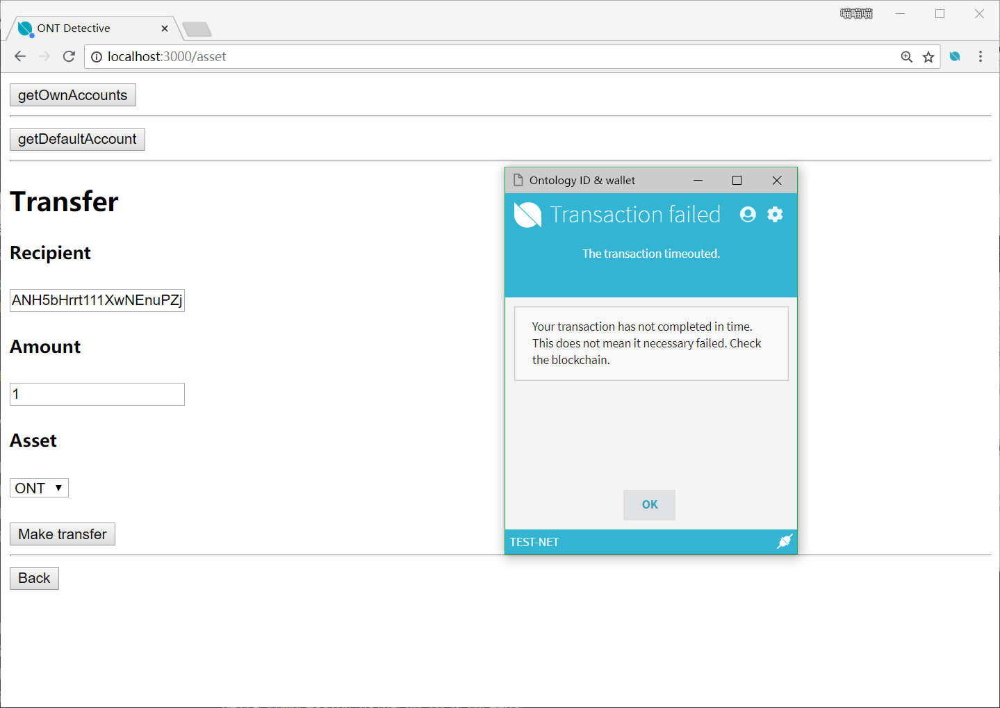


转账失败。

### Smart Contract

#### Smart Contract Call


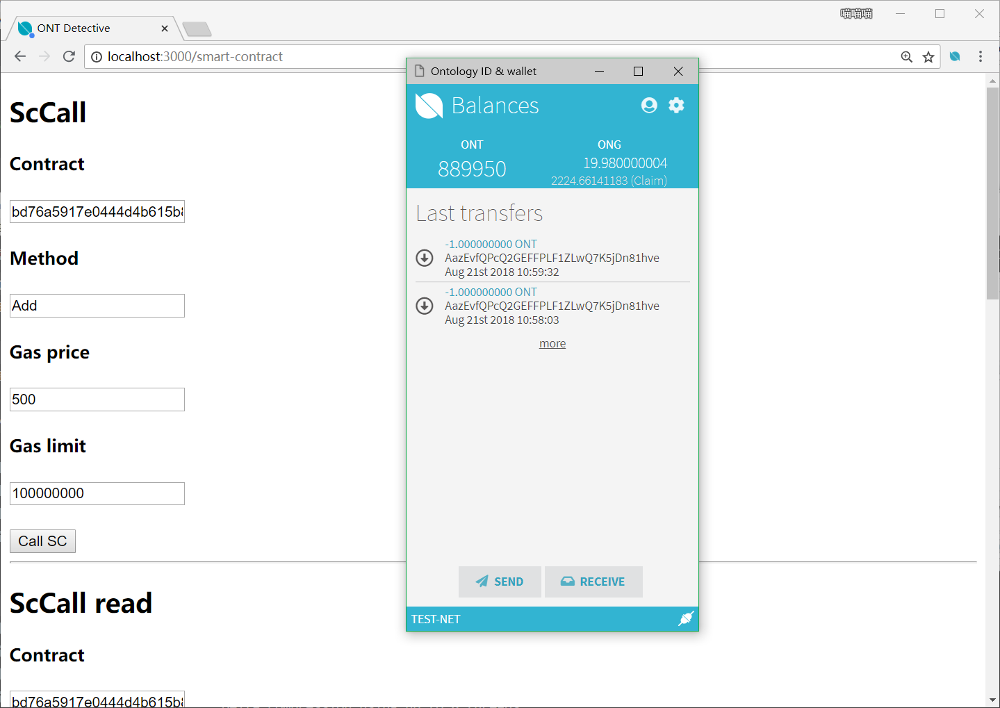


`TxHash`在区块链浏览器中未查询到。

#### Smart Contract Deploy

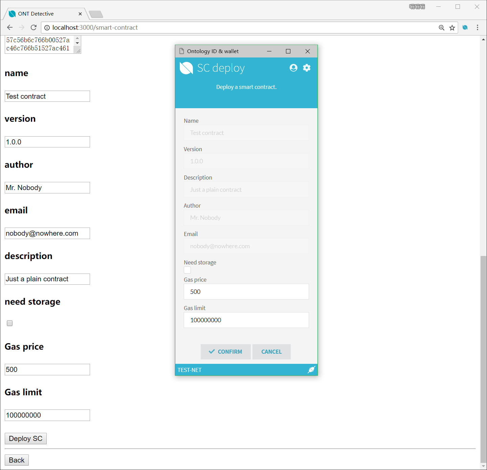

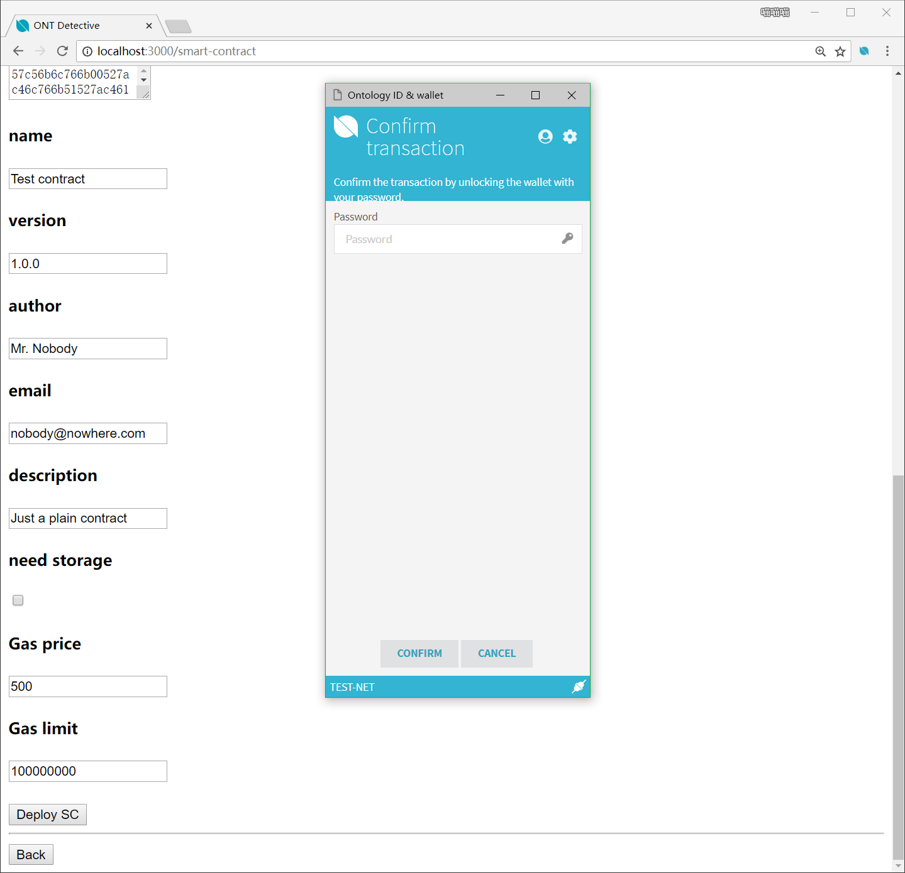

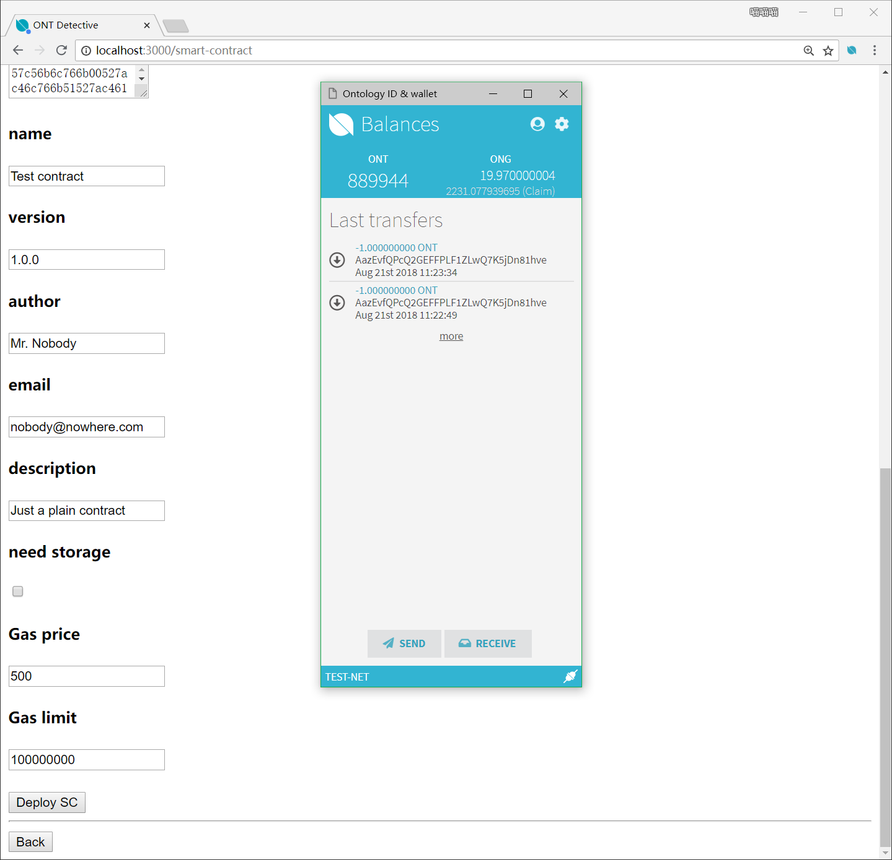


`TxHash`在区块链浏览器中未查询到。